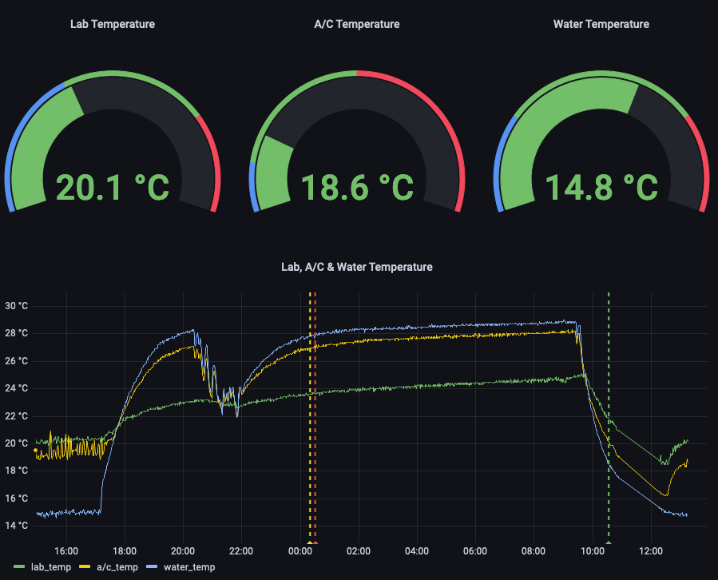

# Experiment Monitoring Software

A software package for automated monitoring of lab equipment, including time series visualization and automatic e-mail alerts.

## Architecture

A central server gathers data from different sources, writes them into a database, hosts a graphic interface for visualization and sends automatic alert e-mails based on user-defined criteria.

## Currently supported interfaces

  * Serial (e.g. Pfeiffer TPG261)
  * TCP/IP (e.g. Arduino Due)
  * Analog [via ADC on Arduino Due] (e.g. Pfeiffer TPG300)
  * SNMP (e.g. Eaton UPS)
  * Phidgets (e.g. Thermocouple module)

## Setup

  * Hardware requirements & server setup: See `server_setup.md`.
  * ADC setup: See `adc_setup.md`. Only needed if you want to monitor analog signals.
  * Working with existing interfaces:
    - `config.py` is all you need to modify.
  * Adding your own interfaces:
    - Write a subclass that extends the abstract `Sensor` class defined in `sensor.py` to drive your sensor/equipment and instantiate it in `config.py`.

## Guide to the repository structure:

  * `calibrations`: Contains calibration data and scripts for all calibrated equipment.
  * `classes`: Contains driver classes for all interfaces. Put your new driver classes in here.
    * `sensor.py`: Abstract base class for individual sensor classes.
    * `adc`: Contains Arduino sketch, its Python Class and its setup guide.
    * `ups`: Implements EatonUPS Class for batteries and their setup guide.
  * `tests`: Contains tests for the Phidget class.
  * `utilities`: Contains interface-independent classes to be used by all sensors.
    * `spike_filter.py`: Spike filter for instances of Sensor subclasses. Enable in `config.py` by setting `sensor.spike_filter.spike_threshold_perc` for any given sensor.
  * `config.py`: Main configuration file.
  * `exec.py`: Main execution file for Linux service and command line execution.
